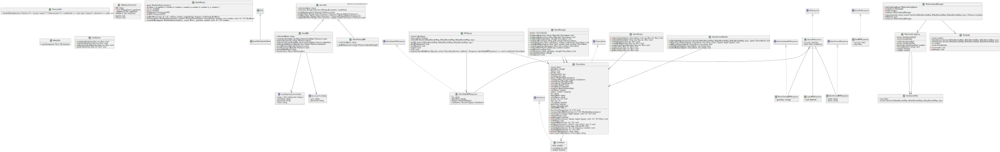

# Real-Time Chess [Capstone Project]

1. [Features](#features)
2. [Known Bugs](#known-bugs)
3. [Build Instructions](#build-instruction)
    1. [Prerequisites](#prerequisites)
    2. [Building](#building)
4. [Required Development Tools](#required-development-tools)
5. [Preferred Development Tools](#preferred-development-tools)
6. [UML Diagrams](#uml-diagrams)
    1. [Server Side](#server-side)
    2. [Client Side](#client-side)
7. [NPM Scripts](#npm-scripts)
    1. [Build](#build)
    2. [Start Server](#start-server)
    3. [Testing and Code Quality](#testing-and-code-quality)
    4. [Documentation](#documentation)

## Features

| Symbol | Meaning           |
| ------ | ----------------- |
| 🟢     | Working Perfectly |
| 🔵     | Working           |
| 🟡     | Working but buggy |
| 🟠     | Still building    |
| 🔴     | Not working       |

| Feature                         | Status |
| ------------------------------- | ------ |
| Signup / Login                  | 🟢     |
| GrandMaster AI                  | 🟢     |
| Single Player                   | 🟢     |
| Multiplayer (Friend)            | 🟢     |
| Multiplayer (Random)            | 🟢     |
| AI v AI Game                    | 🟢     |
| Rejoin Game                     | 🔵     |
| Logout                          | 🟢     |
| Game Rules                      | 🟢     |
| Profile Page                    | 🟢     |
| Game History                    | 🟢     |
| Game Replay (Realtime)          | 🟢     |
| Game Replay (Step forward/back) | 🟢     |
| AutoPilot                       | 🟢     |
| GrandMaster Help                | 🟢     |
| Multiplayer Cooldown            | 🟢     |

-   **GrandMaster AI** – GrandMaster is our in-house solution to determining the best possible next chess move. It was specifically designed with RealTime Chess in mind, and allows for invalid move suggestions (such as capturing a king). It can also be restricted to conform to the rules of regular chess – making it a versatile library. It is based off a modified version of the ChessJS engine.
-   **Single Player** – User can play against the GrandMaster AI with any specified skill level (AI 1 to 10).
-   **Multiplayer (Friend)** – User can start a game. RTC will then provide a game code composed of 5 emojis. The "friend" can then use the builtin emoji keyboard to join the same game.
-   **Multiplayer (Random)** – Creates a random match for two players to play each other without any out-of-application interaction.
-   **AI v AI** – A single user can create a game with two GrandMaster artificial intelligence bots. Their skill levels can be adjusted and the user can watch the two bots (with same or different skill levels) play against each other.
-   **Rejoin Game** – If the user clicks the back button, reloads the page, or unexpectedly quits the tab/browser window, the user can quickly rejoin the game by clicking on the rejoin game button.
-   **Autopilot** – Autopilot allows a user to quickly enable GrandMaster to play for them if they cannot play the game for some reason.
-   **GrandMaster Help** – For users that are stuck, do not know what move to make, or are being heavily attacked by their opponent, they can ask the GrandMaster AI to help them out. GrandMaster will perform a single move for the user. If they are in check(mate) then GrandMaster will allow them to get out of check(mate). If they are in checkmate and require two moves (of different pieces) to get out of check mate, then GrandMaster will perform the two moves.
-   **Multiplayer Cooldown** – Some players don't like cooldown, so they can set the cooldown to only 1 second. Some players love cooldown so they can set it to 10 seconds. The default cooldown is 5 seconds, but in multiplayer matches, the cooldown can be adjusted to any value between 1 and 10 (inclusive).

## Known Bugs

There are no known bugs for v1.0.0.

> The "Rejoin Game" button will be displayed, even if the user is not currently in a game. This is not a bug, but rather a user experience issue. Clicking on the rejoin button does not result in a page crash or server crash – **so we do not consider this a bug**

## Build Instructions

### Prerequisites

1. You must have NodeJS installed (and NPM).
2. You must be running a recent version of macOS, Linux, Windows, or BSD.
3. You must have a recent version of Chrome/Chromium, Safari/Webkit, FireFox.
    - _Note: Chromium-based, webkit-based, and gecko-based browsers should also work, but have not been tested_
4. You must have a terminal or powershell application installed.

### Building

To build:

```bash
npm run build
```

To run in development environment (no need to build, this uses `ts-node`):

```bash
npm run start
```

To run in production:

```bash
node dist/index.js
```

To deploy on a heroku server:

```bash
npm run deploy
cp -r deployment $HEROKU_REPO
cd $HEROKU_REPO
git add -A
git commit -m "Deployment message"
git push heroku master
```

(Where `$HEROKU_REPO` is the path to your heroku git repo)

## Required Development Tools

| Use Case           | Software/Utility | Rationale                                              |
| ------------------ | ---------------- | ------------------------------------------------------ |
| **Autoformat**     | **Prettier**     | So code style **always** conforms to project standards |
| Runtime            | NodeJS           | To run the webserver                                   |
| Package Management | NPM              | To automatically install/manage dependencies           |
| TS Compilation\*   | TypeScript       | To compile TS code to JavaScript via `tsc`             |
| JS Compression\*   | Webpack          | To compress and pack all client-side JS code           |
| SCSS Compilation\* | SASS             | To compile `.scss` files to `.css`                     |

## Preferred Development Tools

| Use Case          | Software/Utility  | Rationale                                   |
| ----------------- | ----------------- | ------------------------------------------- |
| **All** Coding    | Microsoft VS COde | Support for all standard extensions.        |
| Managing Database | MongoDB Compass   | To view/edit MongoDB documents/collections. |

## UML Diagrams

### Server Side



### Client Side


## NPM Scripts

### Build

```
npm run build
```

> `npm run build` will compile all source code.
>
> -   Client Side
>     -   TS/TSX – Webpack
>     -   SCSS – SASS
> -   Server Side
>     -   TS – TSC

To build exclusively server-side or client-side code, use the following:

```
npm run build:server

# or

npm run build:client
```

To build exclusively SCSS files, use the following:

```
npm run build:scss
```

To build exclusively the TS/TSX front-end code (ReactJS), use the following:

```
webpack
```

To Clean the workspace, use the following:

```
npm run clean
```

To clean (rotate) server logs, use the following:

```
npm run rotate-logs
```

### Start Server

```
npm run start
```

### Testing and Code Quality

To run tests locally, use:

```
npm run test
```

If using a coverage reporter (compatible with NYC), use:

```
npm run coverage
```

When trying to Lint the project, use:

```
npm run lint
```

### Documentation

To document the entire project:

```
npm run document
```

To document only the **server**:

```
npm run document:server
```

To document only the **client**:

```
npm run document:client
```

To generate a UML diagram of the project, use:

```
npm run gen-uml
```
