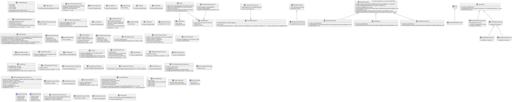

# Real-Time Chess [Capstone Project]

1. [Required Development Tools](#required-development-tools)
2. [Preferred Development Tools](#preferred-development-tools)
3. [NPM Scripts](#npm-scripts)
4.

## Required Development Tools

| Use Case           | Software/Utility | Rationale                                              |
| ------------------ | ---------------- | ------------------------------------------------------ |
| **Autoformat**     | **Prettier**     | So code style **always** conforms to project standards |
| Runtime            | NodeJS           | To run the webserver                                   |
| Package Management | NPM              | To automatically install/manage dependencies           |
| TS Compilation\*   | TypeScript       | To compile TS code to JavaScript via `tsc`             |
| JS Compression\*   | Webpack          | To compress and pack all client-side JS code           |
| SCSS Compilation\* | SASS             | To compile `.scss` files to `.css`                     |

## Preferred Development Tools

| Use Case          | Software/Utility  | Rationale                                   |
| ----------------- | ----------------- | ------------------------------------------- |
| **All** Coding    | Microsoft VS COde | Support for all standard extensions.        |
| Managing Database | MongoDB Compass   | To view/edit MongoDB documents/collections. |

## UML Diagrams

### Server Side


### Client Side



## NPM Scripts

### Build

```
npm run build
```

> `npm run build` will compile all source code.
>
> -   Client Side
>     -   TS/TSX – Webpack
>     -   SCSS – SASS
> -   Server Side
>     -   TS – TSC

To build exclusively server-side or client-side code, use the following:

```
npm run build:server

# or

npm run build:client
```

To build exclusively SCSS files, use the following:

```
npm run build:scss
```

To build exclusively the TS/TSX front-end code (ReactJS), use the following:

```
webpack
```

To Clean the workspace, use the following:

```
npm run clean
```

To clean (rotate) server logs, use the following:

```
npm run rotate-logs
```

### Start Server

```
npm run start
```

### Testing and Code Quality

To run tests locally, use:

```
npm run test
```

If using a coverage reporter (compatible with NYC), use:

```
npm run coverage
```

When trying to Lint the project, use:

```
npm run lint
```

### Documentation

To document the entire project:

```
npm run document
```

To document only the **server**:

```
npm run document:server
```

To document only the **client**:

```
npm run document:client
```

To generate a UML diagram of the project, use:

```
npm run gen-uml
```
